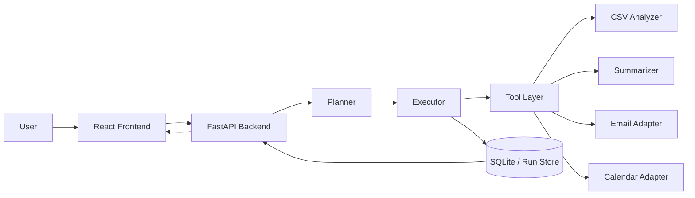

# FlowPilot: Secure AI Workflow Automation Agent

FlowPilot is a round-1-focused hackathon project for an **AI Workflow Automation Agent**. It turns natural language requests into traceable workflow runs across CSV analysis, summarization, email drafting, and meeting scheduling while meeting the mandatory judging requirements around maintainability, security, and deployment.

## Problem statement
Teams waste time bouncing between analytics tools, notes, email, and scheduling. Most agent demos look flashy until they have to handle authentication, traces, and sensitive data without leaking it all over the UI like a badly supervised intern.

## Solution overview
FlowPilot accepts a natural language request, optionally a CSV and report text, then generates a structured workflow plan and executes it step by step. Every step is logged. User authentication is required. PII such as email addresses is masked in API responses and encrypted in storage.

## Core features
- JWT-based login and registration
- Protected workflow, upload, and history endpoints
- CSV upload and analysis
- Report summarization
- Email draft and simulated delivery
- Meeting scheduling in simulation or live-mock mode
- Execution trace and per-user workflow history
- Encrypted PII at rest and masked PII in UI/API responses
- Dockerized frontend and backend with a single compose network

## Architecture summary


## Security measures
- Passwords are hashed with passlib using a strong one-way scheme
- JWT tokens protect uploads, workflow execution, and history access
- User emails are stored encrypted and indexed by hash
- Email addresses are masked in frontend-visible responses and execution traces
- Uploaded preview rows are encrypted in SQLite
- Workflow step payloads are sanitized before being written to storage

## Tech stack
### Backend
- FastAPI
- Pydantic
- SQLite
- pandas
- httpx
- python-jose
- passlib
- cryptography

### Frontend
- React
- Vite
- Plain CSS for speed and reliability

## API endpoints
### Auth
- `POST /api/v1/auth/register`
- `POST /api/v1/auth/login`
- `GET /api/v1/auth/me`

### Workflows
- `POST /api/v1/workflows/run`
- `GET /api/v1/workflows`
- `GET /api/v1/workflows/{run_id}`

### Files
- `POST /api/v1/uploads/csv`

### Health
- `GET /api/v1/health`

## Environment setup
Copy the root example or the backend/frontend examples and fill in your secrets.

```env
OPENAI_API_KEY=
OPENAI_BASE_URL=https://api.openai.com/v1
OPENAI_MODEL=gpt-4.1-mini
JWT_SECRET=replace-with-a-long-random-secret
ENCRYPTION_KEY=replace-with-a-different-secret
DATABASE_PATH=./backend/flowpilot.db
UPLOAD_DIR=./backend/uploads
LOGS_DIR=./backend/logs
ALLOWED_ORIGINS=http://localhost:5173,http://localhost:3000
VITE_API_BASE_URL=http://localhost:8000
```

The API key is intentionally blank. Insert it later when the hackathon gives you one.

## Local development
### Backend
```bash
cd backend
python -m venv .venv
source .venv/bin/activate  # On Windows: .venv\Scriptsctivate
pip install -r requirements.txt
uvicorn app.main:app --reload --port 8000
```

### Frontend
```bash
cd frontend
npm install
npm run dev
```

Frontend: `http://localhost:5173`
Backend: `http://localhost:8000`

## Docker deployment
```bash
docker-compose up --build
```

Docker services:
- Frontend: `http://localhost:3000`
- Backend: `http://localhost:8000`

Everything runs under a single compose-managed network named `flowpilot-net`.

## Demo flow
1. Register or log in.
2. Upload `sample_data/sales_sample.csv`.
3. Run a prompt such as:
   `Analyze this CSV, summarize the findings, schedule a meeting tomorrow afternoon, and email the recap to team@example.com`
4. Show the execution trace, masked email addresses, and recent runs list.
5. Mention that external actions are simulated by default for safety.

## Project structure
```text
flowpilot_hackathon_project/
  backend/
    app/
      config.py
      executor.py
      llm.py
      logging_config.py
      main.py
      pii.py
      planner.py
      schemas.py
      security.py
      store.py
      tools.py
    tests/
    Dockerfile
    .env.example
    requirements.txt
  frontend/
    src/
      App.jsx
      index.css
      main.jsx
    Dockerfile
    .env.example
    package.json
  sample_data/
    sales_sample.csv
  docker-compose.yml
  .env.example
  README.md
```

## Notes for judges
This round-1 build deliberately prioritizes maintainability, authenticated access, encrypted storage, clean REST endpoints, logging, and dockerized deployment. The architecture is modular enough to add queues, real provider integrations, and more advanced observability later without rewriting the system.
